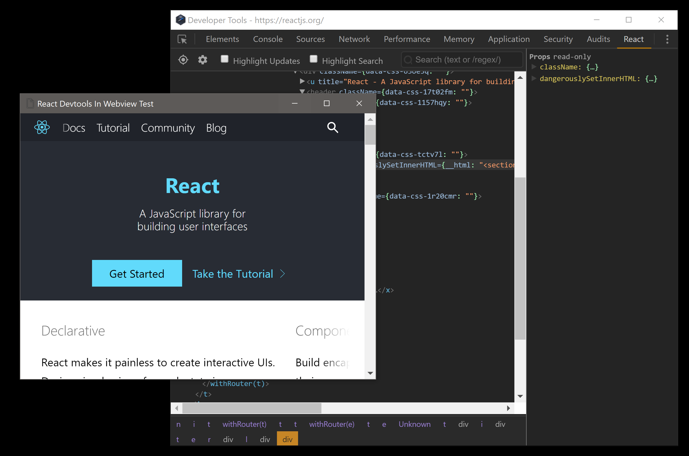

# nwjs-react-devtools-webview-example

Demonstrate that React Devtools is not working when React app is inside a Webview

React Devtools has been modified to add `"chrome-extension://*"` to the `manifest.json` permissions array.

## how to run

Clone the repository then open a command line to the repository and run:

`nw\nw.exe --load-extension=react-devtools react-app`

NW.js 0.23.6 (Windows x64) is included to make this very easy to test.

Screenshot:

## Author(s)

Frank Hale <frankhale@gmail.com>

## License 

GNU GPL v3 - see [LICENSE](LICENSE)